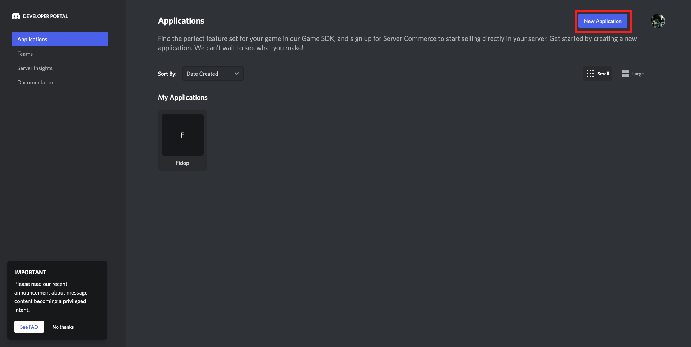
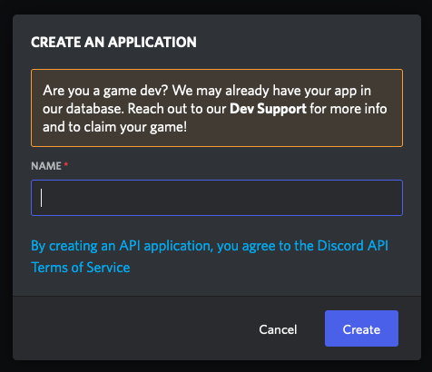
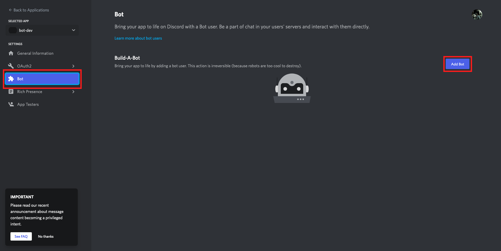
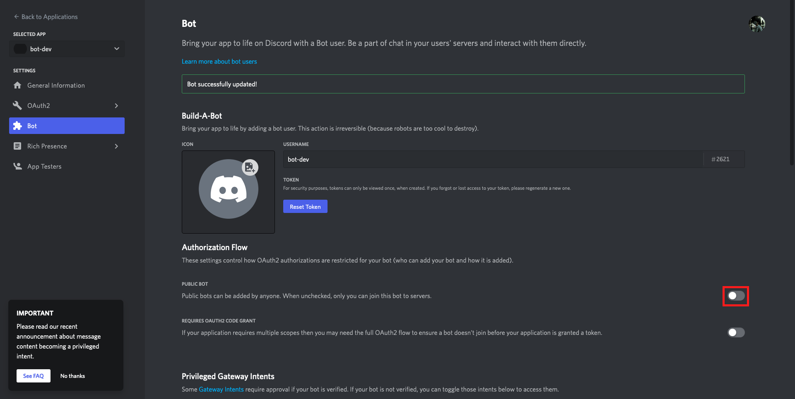
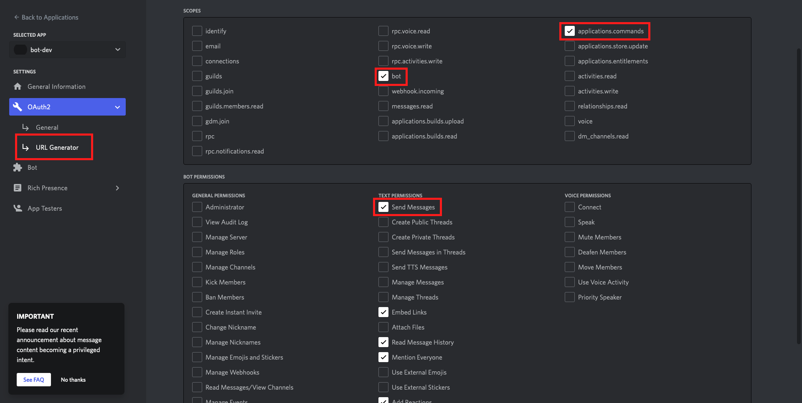
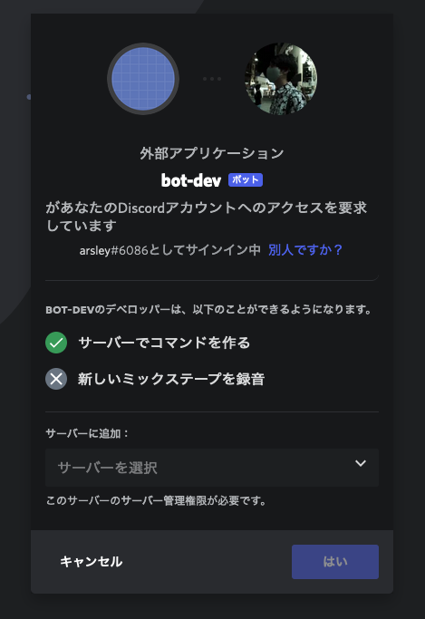
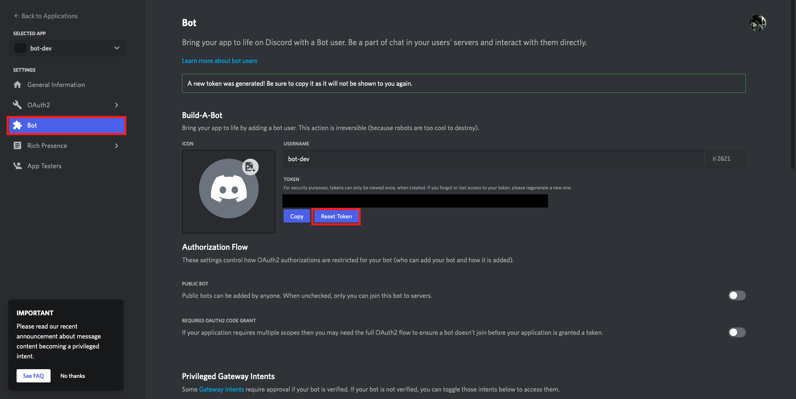
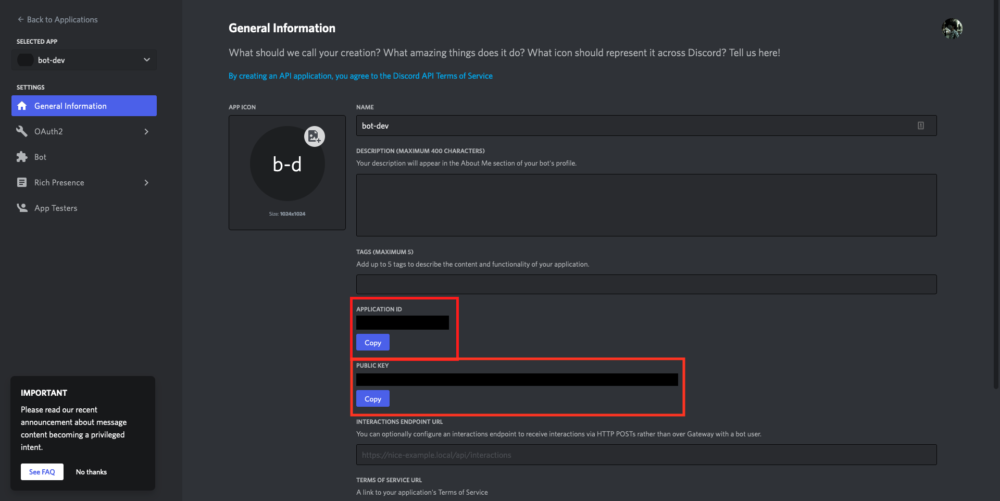
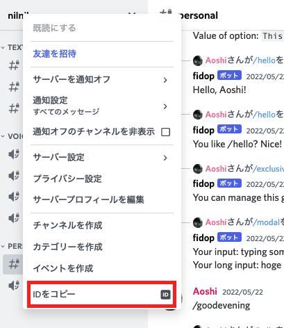
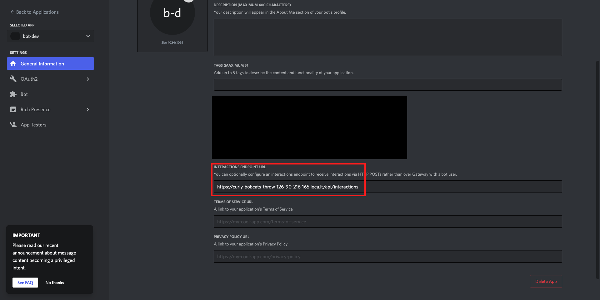

# Development Guide

## TL;DR

1. Discord Dev Portal にて...
    1. Application 作る [↓](#create-app)
    1. Bot 作る [↓](#create-bot)
    1. 作った Bot を動作確認したい鯖へ招待 [↓](#invite-app)
    1. 各種トークンを控える & トークンを `.env` へセット [↓](#set-tokens)
1. Vercel へ GitHub アカウント使って sign up [↓](#vercel-sign-up)
1. `yarn` する [↓](#install-deps)
1. `yarn dev:serve` して CLI から Vercel のログイン済ませる & 実行環境整える [↓](#run-vercel-dev)
1. 実装が進んだら... [↓](#work--check)
    1. Discord Dev Portal の Interactions Endpoint URL に localtunnel の URL + `/api/interactions` をセット [↓](#set-endpoint)
    1. `yarn dev:sync` でコマンドの有効化 [↓](#sync-commands)
    1. Discord から投げる [↓](#check)

## Content

### Create App

[Discord Developer Portal](https://discord.com/developers/applications) の "New Application"でアプリケーションを新規作成する。



名前も適当に決める。



[↑top↑](#tldr)

### Create Bot

サイドバーの "Bot" を選んで "Add Bot" から作成したアプリケーションに Bot を作成する。



なにか聞かれたら "Yes, hogehoge" でOK。
"Public bot" の項目はOFFにする。



[↑top↑](#tldr)

### Invite Bot

サイドバーの "OAuth2 → URL Generator" を選択する。

- `SCOPES` には `applications.commands` と `bot` を設定。
- `BOT PERMISSIONS` は適宜適当に決める。(最低限 `Send Messages` があれば問題ないと思う。)



ページ下まで行って `GENERATED URL` をコピーしてブラウザにそのまま貼り付け。
挙動確認用のサーバなり適当な場所へ招待しておく。



[↑top↑](#tldr)

### Set tokens

`slash-up` コマンドを正しく実行できるように以下4つの環境変数を `.env` に記載する。

- DISCORD_APP_ID
- DISCORD_BOT_TOKEN
- DISCORD_PUBLIC_KEY
- DEVELOPMENT_GUILD_ID

`DISCORD_BOT_TOKEN` は "Bot" の "Reset Token" より発行し直す（デフォルトでは不明なので）。
2度と見れないのでメモ忘れに注意。



`DISCORD_APP_ID` と `DISCORD_PUBLIC_KEY` は "General Information" から確認可能。



`DEVELOPMENT_GUILD_ID` は Bot を追加したサーバのIDを設定する。
Discord 上からサーバ名を右クリック→「IDをコピー」から取得できる。
「IDをコピー」が表示されない場合は Discord の「開発者モード」を有効化してから試して。



[↑top↑](#tldr)

### Vercel sign-up

https://vercel.com/ の "Sign Up" から "Continue with GitHub" を選択して Vercel のアカウントを作る。
特にこだわりがなければ設定は必要ない。

[↑top↑](#tldr)

### Install deps

必要な依存を `yarn` でインストールする。

[↑top↑](#tldr)

### Run `vercel dev`

依存のインストール後に `yarn dev:serve` を実行する。
すると「Vercel 上の project を新しく作るか?」などのことを聞かれるので（初回のみ）基本はデフォルト設定で通過してOK。
ログインを要求されたら従ってください。

```
$ yarn dev:serve

Vercel CLI 24.2.4
? Set up and develop “path/to/fidop”? [Y/n] y
? Which scope should contain your project? <Username>
? Link to existing project? [y/N] n
? What’s your project’s name? fidop
? In which directory is your code located? ./
No framework detected. Default Project Settings:
- Build Command: `npm run vercel-build` or `npm run build`
- Output Directory: `public` if it exists, or `.`
- Development Command: None
? Want to override the settings? [y/N] n
🔗  Linked to <Username>/fidop (created .vercel)
> Creating initial build
Running "yarn run build"
yarn run v1.22.19
$ tsc
✨  Done in 1.26s.
> Success! Build completed
> Ready! Available at http://localhost:8080

# ctrl-c で停止する
```

[↑top↑](#tldr)

### Work & check

`yarn start` で `vercel dev` と `localtunnel` をまとめて実行できる。
**注意 : 挙動確認するときは `yarn start` を実行したままに。**

```
$ yarn start

...
[dev:serve]
[dev:serve] > slash-create-vercel-template@1.0.0 dev:serve
[dev:serve] > vercel dev -l 8080
[dev:serve]
[dev:tunnel]
[dev:tunnel] > slash-create-vercel-template@1.0.0 dev:tunnel
[dev:tunnel] > lt -p 8080 --print-requests
[dev:tunnel]
[dev:serve] Vercel CLI 24.2.4
[dev:serve] Retrieving project...
[dev:serve] > Creating initial build
[dev:serve] Running "yarn run build"
$ tsc
[dev:serve] > Success! Build completed
[dev:serve] > Ready! Available at http://localhost:8080
[dev:tunnel] your url is: https://<random-uri>.loca.lt
...

# Ctrl-C で停止
```

[↑top↑](#tldr)

#### Set endpoint

実装が一段落したら `yarn start` で実行される `localtunnel` が提供するエンドポイントをコピーする。
例 : `https://giant-ducks-join-126-90-216-165.loca.lt`

コピーしたリンクを "General Information" の "INTERACTIONS ENDPOINT URL" にセットする。
**重要 : このときにURLの末尾へ `/api/interactions` を追記する。**



"Save Changes" を押してエラーが表示されなければ疎通成功。

[↑top↑](#tldr)

#### Sync commands

セット後、コンソールから `yarn sync:dev` を実行してコマンドをDiscordへ反映する。

[↑top↑](#tldr)

#### Check

Discord から任意の /command を実行して挙動を確認する。

[↑top↑](#tldr)
